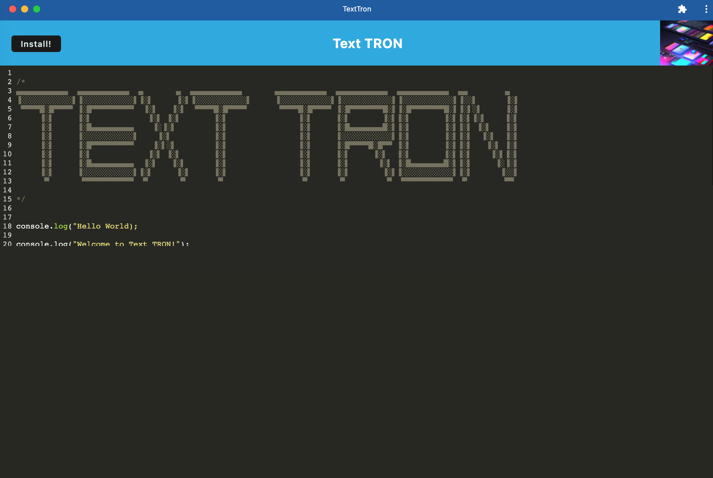
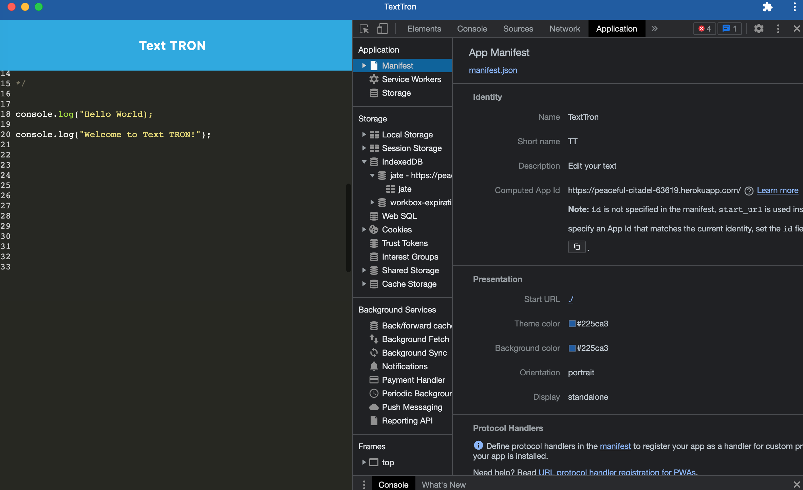
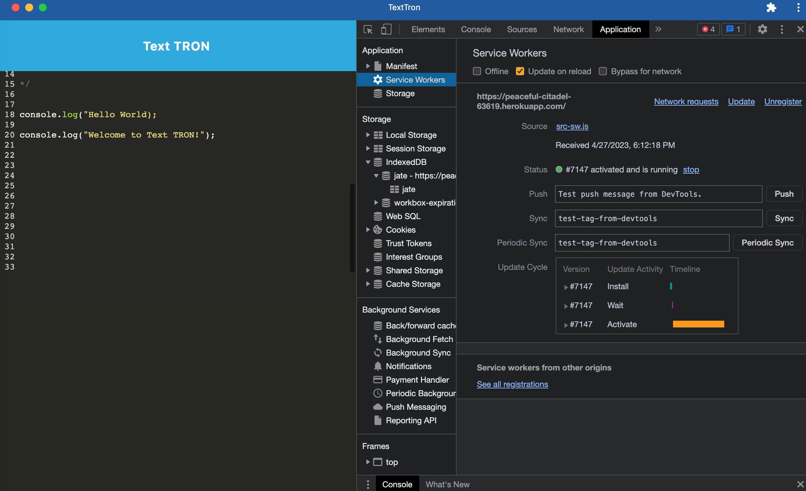
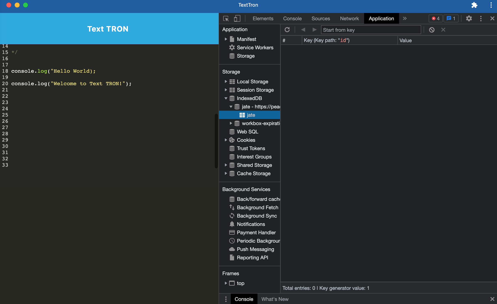

# Text TRON

## Description

The Text Tron text editor is a simple text editor application that can function both online and offline. This application implements methods for getting and storing data to an `IndexedDB` database. For offline use, Text Tron can be downloaded to your desktop as an application. The integrated service worker and Cache API's ensure that this application will remain fully functional even when offline.

---

## Table of Contents

- [Technologies](#technologies)
- [Installation](#installation)
- [Usage](#usage)
- [Screenshots](#screenshots)
- [Licenses](#licenses)
- [Contributing](#contributing)
- [Tests](#tests)
- [Questions](#questions)
- [Credits](#credits)

---

## Technologies

- HTML
- CSS
- JavaScript
- Node.js
- Express.js
- Webpack
- Workbox

---

## Installation

- Open Heroku deployed application : https://peaceful-citadel-63619.herokuapp.com/

- Go to the link and hit the "install" button to install the app locally.

For repo clone or download:

- Download or clone repository to use this application on local machine.

- Node.js is required to run the application

- To install necessary dependencies, run the following command : `npm i`

- Run `npm run dev` and `npm run start` in terminal to start.

- Then go to http://localhost:8080/ to run this application on your local machine.

---

## Usage

To use Text TRON, please visit the deployed Heroku link: https://peaceful-citadel-63619.herokuapp.com/

Or click 👉 [Text TRON](https://peaceful-citadel-63619.herokuapp.com/)

---

## Screenshots

Text Tron Screenshot:

Screenshot with `manifest.json` file:

Screenshot with registered service worker:

Screenshot with IndexedDB storage:

---

## Licenses

      This project is covered under the MIT license. To learn more about what this means, click the license button at the top.

---

## Contributing

If you have any improvements or recommendations for this project please reach out.

## Tests

N/A

---

## Questions

Have questions about this project? Please reach out to me.

| GitHub Username             | Email              |
| --------------------------- | ------------------ |
| https://github.com/TyGosley | tygosley@gmail.com |

## Credits

---

[Webpacl](https://webpack.js.org/)

[Workbox](https://developer.chrome.com/docs/workbox/reference/workbox-webpack-plugin/#type-GenerateSW)

[Node.JS](https://nodejs.org/en/docs)

[Express.JS](https://expressjs.com/en/guide/routing.html#express-router)

[Codecademy](https://www.codecademy.com/learn)

[Khan Academy](https://www.khanacademy.org/)

[MDN Docs](https://developer.mozilla.org/en-US/)

[W3Schools](https://www.w3schools.com/js/default.asp)

[JavaScript.info](https://javascript.info/)

[CodeHS](https://codehs.com/)
